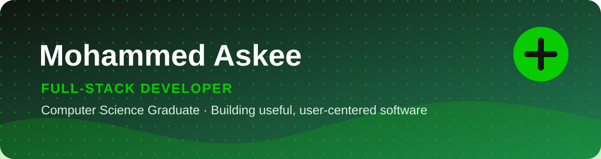
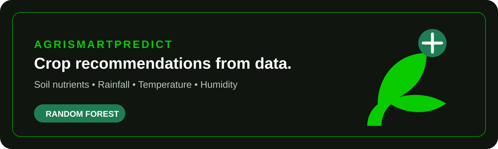
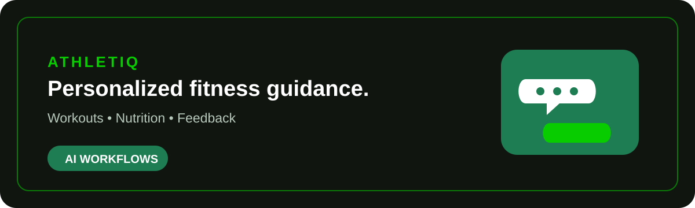
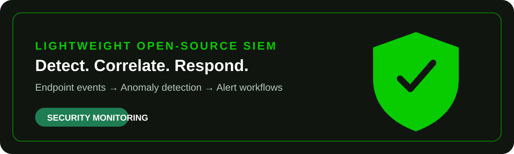
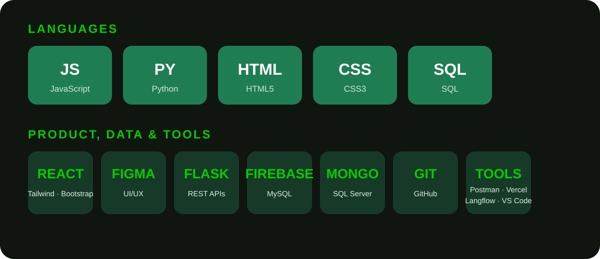

  

  

    I build responsive, user-centered web applications and practical intelligent systems - from polished interfaces and REST APIs to data-driven tools.
  

  

    <a href="mailto:askeeofficial2001@gmail.com">Email me</a>
    &nbsp;&nbsp;•&nbsp;&nbsp;
    <a href="https://www.linkedin.com/in/mohammedaskee">LinkedIn</a>
    &nbsp;&nbsp;•&nbsp;&nbsp;
    <a href="https://mohammedaskee2.wordpress.com">Portfolio</a>
    &nbsp;&nbsp;•&nbsp;&nbsp;
    <a href="https://github.com/MohammedAskee">GitHub</a>
  

## Building software with clarity and purpose

I'm a Computer Science graduate with hands-on experience across front-end development, UI/UX, machine learning, and network engineering. I care about the full path from an idea to a useful, well-designed product, and I am open to full-stack, front-end, and software development opportunities.

## What I work on

- **Web applications** - responsive interfaces, REST APIs, and deployment-ready web experiences.
- **Product interfaces** - wireframes, prototypes, and thoughtful UI/UX decisions in Figma.
- **Intelligent systems** - practical machine learning and AI-assisted applications built around clear user needs.

## Featured work

### [AgriSmartPredict](https://github.com/MohammedAskee/AgriSmartPredict)

**Machine learning crop recommendation system**

Recommends suitable crops from soil nutrients, rainfall, temperature, and humidity using a Random Forest model. The evaluated model achieved **92% prediction accuracy**.

`Python` · `scikit-learn` · `pandas` · `NumPy` · `Random Forest`

### [AthletiQ](https://github.com/MohammedAskee/AthletiQ-Fitness-Coach)

**AI fitness coach**

An AI-powered conversational experience for personalized workout guidance, nutrition tips, and feedback. The workflow is composed in Langflow with modular blocks and custom prompts.

`Langflow` · `AI workflows` · `Prompt design`

### Lightweight Open-Source SIEM

**Final-year endpoint security project**

A lightweight threat-detection system combining Wazuh correlation rules with Isolation Forest anomaly detection, supported by dashboards and alert workflows.

`Wazuh` · `Python` · `Isolation Forest` · `Security monitoring`

  <a href="https://github.com/MohammedAskee?tab=repositories">Explore all repositories</a>

## Experience, in context

My internships have given me practical exposure to front-end development, UI/UX design, machine learning, and data-center networking. Most recently, I developed the AgriSmartPredict ML pipeline at Arch Technologies; earlier work at Codsoft focused on responsive front-end builds and interface design, while a PAF-IAST data-center placement deepened my networking and operational perspective.

## Technology stack

  

JavaScript · Python · HTML5 · CSS3 · SQL &nbsp; | &nbsp; React · Tailwind · Bootstrap · Figma &nbsp; | &nbsp; Flask · Firebase · MySQL · MongoDB &nbsp; | &nbsp; Git · GitHub · Postman · Vercel · Langflow · VS Code

## Currently building

> **Now working on:** _[Project name] - [one-sentence description of the problem you are solving]._  
> **Next up:** _[A project, skill, or feature you plan to explore next]._

## Current focus

I am strengthening my full-stack foundations, building more polished product experiences, and exploring practical AI-powered applications. I am especially interested in work where thoughtful interfaces, maintainable engineering, and real-world problem solving meet.

## GitHub activity

  <picture>
    <source media="(prefers-color-scheme: dark)" srcset="https://raw.githubusercontent.com/MohammedAskee/MohammedAskee/output/github-contribution-grid-snake-dark.svg" />
    <source media="(prefers-color-scheme: light)" srcset="https://raw.githubusercontent.com/MohammedAskee/MohammedAskee/output/github-contribution-grid-snake.svg" />
    
  </picture>

The contribution animation is rebuilt daily from public GitHub activity. You can always view the live contribution graph and repositories directly on [my GitHub profile](https://github.com/MohammedAskee).

## Let's build something useful

If you are hiring, collaborating, or working on a product that could benefit from a thoughtful developer perspective, I would be glad to connect.

  <a href="mailto:askeeofficial2001@gmail.com">Start a conversation</a>
  &nbsp;&nbsp;•&nbsp;&nbsp;
  <a href="https://www.linkedin.com/in/mohammedaskee">Connect on LinkedIn</a>

