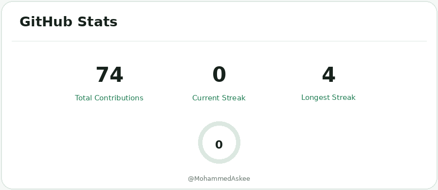

# Mohammed Askee

### Full-Stack Developer · UI/UX Designer · Computer Science Graduate

I design and build <strong>useful digital products</strong> —
from polished interfaces and web applications to practical AI-powered systems.

 

<!-- HERO CONTACT BUTTONS -->

&nbsp;

&nbsp;

&nbsp;

  

---

## Developer snapshot

<table>
<tr>

<td width="25%" align="center">

### Web

**Full-Stack Development**

Responsive applications, APIs, databases and modern web experiences.

</td>

<td width="25%" align="center">

### Design

**UI/UX & Product Design**

Interfaces, prototypes, interaction design and design systems.

</td>

<td width="25%" align="center">

### Intelligence

**AI & Machine Learning**

Practical ML systems and AI-powered applications.

</td>

<td width="25%" align="center">

### Systems

**Networking & Security**

Infrastructure, monitoring and security-oriented engineering.

</td>

</tr>
</table>

---

## About me

I'm a **Computer Science graduate** with hands-on experience across **full-stack development, front-end engineering, UI/UX design, machine learning, and networking**.

I enjoy taking a project from an initial idea to something people can actually use — understanding the problem, designing the experience, building the system, and refining the details.

My approach sits at the intersection of **engineering, design, and practical problem solving**.

### What I care about

- Building interfaces that are **clear and intuitive**
- Writing software that is **maintainable and scalable**
- Turning ideas into **working products**
- Applying AI and machine learning to **practical problems**
- Continuously improving both **engineering and design**

---

# What I build

<table>
<tr>

<td width="50%" valign="top">

### Web & Full-Stack

Responsive web applications, REST APIs, authentication, databases, state management, and deployment-ready systems.

</td>

<td width="50%" valign="top">

### UI/UX & Product Design

Wireframes, prototypes, responsive interfaces, interaction design, and user-centered product decisions.

</td>

</tr>

<tr>

<td width="50%" valign="top">

### AI & Machine Learning

Recommendation systems, ML pipelines, AI-assisted applications, prompt-based workflows, and applied experimentation.

</td>

<td width="50%" valign="top">

### Systems & Networking

Networking fundamentals, data-center operations, monitoring, and security-oriented engineering.

</td>

</tr>
</table>

---

# Featured work

<table>
<tr>

<td width="65%" valign="top">

## 🌱 AgriSmartPredict

### Machine Learning Crop Recommendation

A practical machine-learning system that recommends suitable crops using environmental and soil-related parameters.

**Inputs**

`N` `P` `K` `Temperature` `Humidity` `Rainfall`

**Model**

`Random Forest`

**Result**

**~92% evaluated prediction accuracy**

 

</td>

<td width="35%" align="center" valign="middle">

  

  

 

</td>

</tr>
</table>

---

<table>
<tr>

<td width="35%" align="center" valign="middle">

  

 

</td>

<td width="65%" valign="top">

## 🏃 AthletiQ

### AI Fitness Coach

An AI-powered conversational experience designed to provide personalized workout guidance, nutrition suggestions, and feedback.

The workflow is composed in **Langflow** using modular blocks and custom prompts.

**Built with**

`Langflow` · `AI Workflows` · `Prompt Design`

 

</td>

</tr>
</table>

---

<table>
<tr>

<td width="65%" valign="top">

## 🛡️ Lightweight Open-Source SIEM

### Endpoint Threat Detection

A lightweight threat-detection system combining **Wazuh correlation rules** with **Isolation Forest anomaly detection**, supported by dashboards and alert workflows.

**Core technologies**

`Wazuh` · `Python` · `Isolation Forest` · `Security Monitoring`

This project represents my final-year work combining conventional detection techniques with practical machine learning.

</td>

<td width="35%" align="center" valign="middle">

  

  

</td>

</tr>
</table>

---

# Technology stack

### Languages

 

  

### Frontend & UI/UX

 

  

### Backend & Databases

 

  

### Tools & Workflow

 

---

# Experience

### Arch Technologies
**Machine Learning / Software Development Internship**

Developed and evaluated the **AgriSmartPredict** machine-learning pipeline, working through data preparation, feature handling, model training, evaluation, and application-oriented output.

### Codsoft
**Front-End Development / UI/UX Internship**

Worked on responsive front-end interfaces and practical UI/UX implementation, translating design decisions into usable web experiences.

### PAF-IAST Data Center
**Networking / Operations Internship**

Gained practical exposure to data-center infrastructure, networking operations, monitoring, and the operational side of maintaining technical systems.

---

# Currently exploring

<table>
<tr>

<td width="33%" align="center">

### Full-Stack

React · Node.js · REST APIs · Databases

</td>

<td width="33%" align="center">

### AI

AI applications · ML systems · AI workflows

</td>

<td width="33%" align="center">

### Product

UI systems · UX · Design engineering

</td>

</tr>
</table>

---

# How I approach a project

<table>
<tr>

<td align="center">

### 01

**Understand**

Problem & users

</td>

<td>→</td>

<td align="center">

### 02

**Design**

Structure & experience

</td>

<td>→</td>

<td align="center">

### 03

**Build**

System & interface

</td>

<td>→</td>

<td align="center">

### 04

**Refine**

Test & improve

</td>

<td>→</td>

<td align="center">

### 05

**Ship**

Useful product

</td>

</tr>
</table>

I care about the relationship between **engineering quality and product quality**.

Good software should not only work.

It should be understandable, maintainable, accessible, and useful to the people who rely on it.

---

# GitHub activity

<!-- CUSTOM GITHUB STATS -->

<picture>
  <source
    media="(prefers-color-scheme: dark)"
    srcset="./assets/github/stats-dark.png"
  >

  <source
    media="(prefers-color-scheme: light)"
    srcset="./assets/github/stats-light.png"
  >

  
</picture>

  

<!-- CONTRIBUTION SNAKE -->

<picture>
  <source
    media="(prefers-color-scheme: dark)"
    srcset="./assets/github/snake-dark.svg"
  >

  <source
    media="(prefers-color-scheme: light)"
    srcset="./assets/github/snake-light.svg"
  >

  
</picture>

  

---

# GitHub at a glance

---

# A little more about my work

<strong>Frontend & product development</strong>

 

I enjoy building responsive interfaces where visual design and engineering meet.

My frontend work focuses on:

- Component-based architecture
- Responsive layouts
- Reusable UI patterns
- API integration
- State management
- Accessibility
- Performance
- Clean interaction design

<strong>Backend & application development</strong>

 

I have experience working with REST APIs, application logic, authentication, databases, and backend integrations.

Areas I've worked with include:

- Node.js
- Express
- Flask
- MongoDB
- MySQL
- Firebase
- REST APIs
- Authentication
- API testing with Postman

<strong>AI & machine learning</strong>

 

My ML work is focused on practical applications rather than models for the sake of models.

I've worked with:

- Data preprocessing
- Feature engineering
- Supervised learning
- Random Forest
- Model evaluation
- Recommendation systems
- AI workflows
- Prompt design

<strong>Networking & systems</strong>

 

I have practical exposure to networking and data-center environments, including infrastructure operations, monitoring, and security-oriented systems.

---

# What I'm interested in

`Full-Stack Development`
&nbsp; · &nbsp;
`Frontend Engineering`
&nbsp; · &nbsp;
`UI/UX`
&nbsp; · &nbsp;
`AI Applications`
&nbsp; · &nbsp;
`Machine Learning`
&nbsp; · &nbsp;
`Developer Tools`

---

# Let's build something useful

Whether you're hiring, collaborating, or exploring an idea,
I'd be happy to hear from you.

 

&nbsp;

&nbsp;

  

&nbsp;

 

Engineering with purpose · Designing with people in mind

