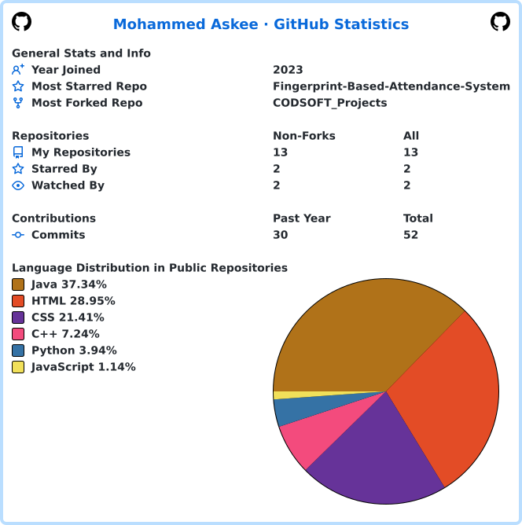

# Mohammed Askee

### Full-Stack Developer · UI/UX Designer · Computer Science Graduate

I build **responsive web applications, thoughtful product interfaces, and practical AI-powered systems** — turning ideas into useful software with clean engineering and a strong focus on the user experience.

 

  

&nbsp;

---

## About me

I'm a **Computer Science graduate** with hands-on experience across **front-end development, full-stack engineering, UI/UX design, machine learning, and network engineering**.

I enjoy working across the product lifecycle — from understanding a problem and designing the interface to building the application, connecting APIs, and refining the final experience.

**Currently focused on:** strengthening full-stack development, building polished product experiences, and exploring practical AI-powered applications.

---

## What I build

<table>
<tr>
<td width="50%" valign="top">

### Web & Full-Stack

Responsive interfaces, REST APIs, authentication, databases, and deployment-ready applications.

</td>
<td width="50%" valign="top">

### UI/UX & Product Design

Wireframes, prototypes, responsive layouts, design systems, and user-centered product decisions.

</td>
</tr>

<tr>
<td width="50%" valign="top">

### AI & Machine Learning

Practical ML pipelines, recommendation systems, AI-assisted applications, and workflow automation.

</td>
<td width="50%" valign="top">

### Systems & Networking

Networking fundamentals, data-center operations, monitoring, and security-oriented engineering.

</td>
</tr>
</table>

---

## Featured work

### 🌱 [AgriSmartPredict](https://github.com/MohammedAskee/AgriSmartPredict)

**Machine-learning crop recommendation system**

Recommends suitable crops using **soil nutrients, rainfall, temperature, and humidity**. The evaluated Random Forest model achieved approximately **92% prediction accuracy**.

`Python` `scikit-learn` `pandas` `NumPy` `Random Forest`

**[View repository →](https://github.com/MohammedAskee/AgriSmartPredict)**

---

### 🏃 [AthletiQ — Fitness Coach](https://github.com/MohammedAskee/AthletiQ-Fitness-Coach)

**AI-powered conversational fitness experience**

A conversational assistant for personalized workout guidance, nutrition tips, and feedback. The workflow is composed in Langflow using modular blocks and custom prompts.

`Langflow` `AI Workflows` `Prompt Design`

**[View repository →](https://github.com/MohammedAskee/AthletiQ-Fitness-Coach)**

---

### 🛡️ Lightweight Open-Source SIEM

**Final-year endpoint security project**

A lightweight threat-detection system combining **Wazuh correlation rules** with **Isolation Forest anomaly detection**, supported by dashboards and alert workflows.

`Wazuh` `Python` `Isolation Forest` `Security Monitoring`

> This project represents my final-year security work and demonstrates my interest in combining conventional detection rules with practical machine learning.

---

## Technology stack

### Languages

  

  

### Frontend & Design

  

### Backend, Databases & AI

  

  

### Tools & Platforms

  

  <code>Langflow</code>
  ·
  <code>REST APIs</code>
  ·
  <code>UI/UX</code>
  ·
  <code>Machine Learning</code>

---

## Experience

### Arch Technologies
**Machine Learning / Software Development Internship**

Built and evaluated the **AgriSmartPredict** machine-learning pipeline, working through data preparation, feature handling, model training, evaluation, and application-oriented output.

### Codsoft
**Front-End Development / UI/UX Internship**

Worked on responsive front-end interfaces and practical UI/UX implementation, translating design decisions into usable web experiences.

### PAF-IAST Data Center
**Networking / Operations Internship**

Gained practical exposure to data-center infrastructure, networking operations, monitoring, and the operational side of maintaining technical systems.

---

## GitHub at a glance

<picture>
  <source media="(prefers-color-scheme: dark)" srcset="./images/userstats-dark.svg">
  <source media="(prefers-color-scheme: light)" srcset="./images/userstats-light.svg">
  
</picture>

  Automatically generated from GitHub activity and updated by GitHub Actions.

---

## Contribution activity

<picture>
  <source media="(prefers-color-scheme: dark)" srcset="https://ghchart.rshah.org/08CB00/MohammedAskee">
  <source media="(prefers-color-scheme: light)" srcset="https://ghchart.rshah.org/1F7D53/MohammedAskee">
  
</picture>

  <a href="https://github.com/MohammedAskee?tab=repositories">
    Explore my repositories →
  </a>

---

## Currently building

> **Now:** _Replace this line with the project you're actively building and the problem it solves._
>
> **Next:** _Replace this line with the skill, technology, or product idea you're planning to explore._

---

## My approach

**Understand the problem**

↓  

**Design the experience**

↓

**Build the system**

↓

**Test & refine**

↓

**Ship something useful**

I care about the connection between **good engineering and good product design**.

The goal is not simply to make software work — it is to make software that people can understand, use, and trust.

---

## Let's build something useful

If you're hiring, collaborating, or working on a product that could benefit from a developer who enjoys both **engineering and product thinking**, I'd be glad to connect.

  

Useful software should feel as good as it works.

